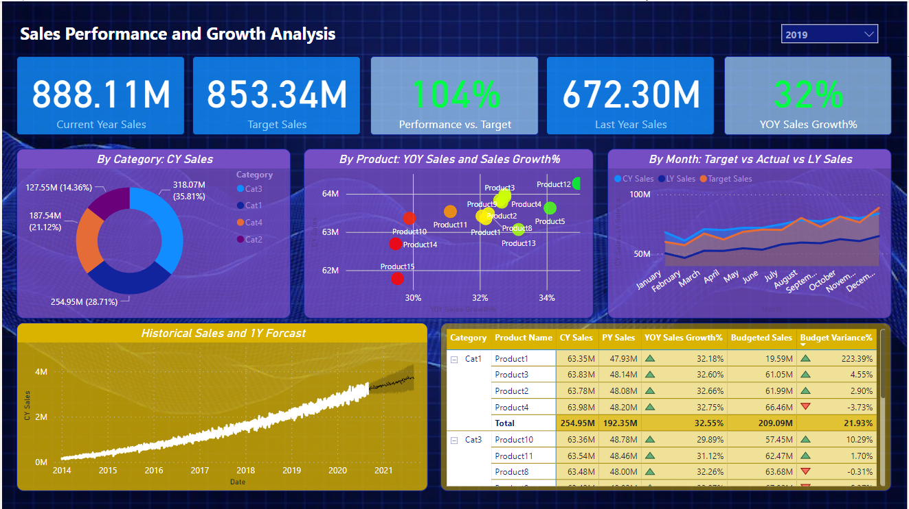

#### Power BI Portfolio Project
# Sales Performance and Growth Analysis

## Objective:

This dashboard analyses current sales performance vs. targets and prior year sales with YoY sales growth% and historical data from the last several years.

Performance and YoY growth% can be analysed by product, category, and month-wise timeline. There is a 1-year sales forecast using an exponential trendline and custom tooltips with graphs to show drill downs in the main page.

## Using:

- Data Cleaning
    - Fixing missing values and blank rows
    - Data Preprocessing
    - Creating relationships with fact and dimension tables
    - New tables, columns, measures 
- DAX Functions for Analysis 
    - CALCULATE, SUM, DIVIDE, MIN/MAX
    - SAMEPERIODLASTYEAR, VAR, RETURN
- Data Visualisation & Publishing
    - Matrix table with indicators 
    - Conditional formatting for RAG analysis
    - Forecasting in PowerBI
    - Custom tooltips with graphs
    - Standard publishing to PowerBI service
